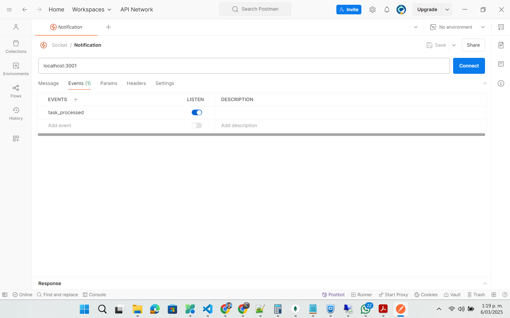

# Prueba Técnica Koibanx

## Descripción

Se implementó una solución para la validación y carga de archivos en formato Excel, utilizando el framework NestJS para el backend. A continuación, se detallan las tecnologías empleadas:

### Tecnologías Utilizadas

1. **MongoDB** como base de datos, utilizando Mongoose como ORM para la persistencia.
2. **RabbitMQ** para la gestión de colas de mensajes y el procesamiento asíncrono de los archivos y sus validaciones.
3. **Socket.io** para notificaciones en tiempo real mediante WebSockets, permitiendo visualizar el progreso del proceso en vivo. En la carpeta `postman`, se encuentra una imagen con la configuración del socket y el evento correspondiente para ver notificaciones y resultados en tiempo real.

4. **xlsx** como dependencia para el procesamiento de archivos en formato `.xlsx`.
5. En la carpeta `postman`, se encuentra la colección que permite conectarse al API del backend.

6. La carpeta `templates` contiene archivos de ejemplo para casos de validación correcta e incorrecta.
7. La carpeta `uploads` almacena todos los archivos cargados a través del backend para su posterior procesamiento.
8. En el archivo .env de encuenta las variables de entorno que se usan para la configuracion, los servicio de mongodb y rabbitmq se integran con servicio cloud.

## Arquitectura de la Aplicación

La aplicación cuenta con cuatro módulos principales:

- **AppModule**: Configura el bootstrap de la aplicación y enlaza los demás módulos.
- **TasksModule**: Administra las tareas, permitiendo su registro y la persistencia de datos.
- **RabbitMQModule**: Maneja la configuración e integración de colas de mensajes. Contiene dos servicios:
  - **RabbitMQProducerService**: Encargado de registrar en las colas la información de las tareas a procesar.
  - **RabbitMQConsumerService**: Consume las tareas en cola y las procesa, realizando la validación y procesamiento de los archivos. Además, genera las notificaciones correspondientes.
- **NotificationsModule**: Integra con el gateway de Socket.IO para gestionar las notificaciones en tiempo real.

Este proyecto facilita la carga, validación y procesamiento de archivos Excel de manera eficiente y escalable, asegurando la entrega de notificaciones en tiempo real sobre el estado del proceso.

